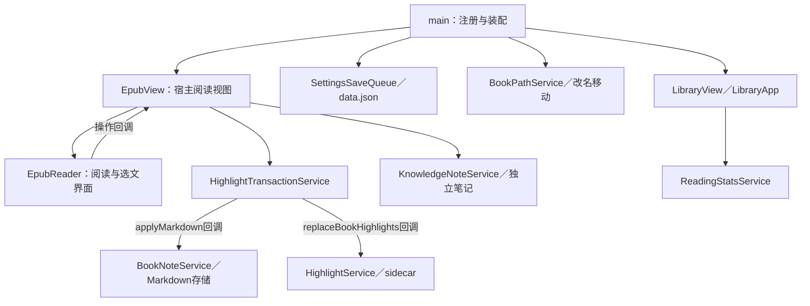

# 当前代码梳理与整改清单

2026-10-02 用户决定移除阅读器外查词：删除全局Markdown选词翻译／词条标记悬停模块、注册、专属CSS和旧开关；保留EPUB功能及已收藏数据。216项verify通过；实机Markdown编辑／阅读选词无卡，重载前后词条一致，EPUB右键离线释义正常；AI与保存未本轮调用。原Markdown悬停待验因功能退出作废。未提交发布、日常库未改。详见 docs/plans/2026-10-02 移除阅读器外查词功能.md。

2026-10-02 Q03初始化进度限定修复：定位表生成中只显示章内页码，不保存临时估算；完成刷新当前定位，失败／空结果恢复降级，准确0%保留，忽略失败残留的部分定位表。9项新增回归（含逐章填充与中途失败），17项进度测试和213项完整verify通过。初版已在测试库采集4次pending均未保存，完成／翻页／关闭重开恢复一致；最终构建在解锁后已实机重载，两次pending均无保存，locations完成132条后仅保存准确0.2366412213740458；翻页及关闭重开恢复通过。Q01／Q02已限定修复；既有实机缺口仍保留，下一步收口验收，不自动扩大清理。未提交推送发布，日常库未改。

2026-10-02 Q02迟到加载限定修复完成：加载代次／卸载标记与当前文件检查，等待后验证，预读完再createRoot，保护旧保存／注册／主题回调；11项生命周期回归及204项完整verify通过。测试库真实受控读取中关闭、同leaf慢旧加载切书检查通过，临时拦截finally恢复，原书正文恢复。热重载外壳单独未确诊，真实改名未本轮重验；Q03及既有验收缺口保留。详见 [Q02修复记录](2026-10-02%20Q02阅读器迟到加载修复.md)。未提交推送发布，日常库未改。

2026-10-02 Q01书签并发保存限定修复完成：BookStateService内串行添加／删除／运行状态清理的完整操作，失败回滚后下一操作重新读取；8项新增回归先失败后通过，193项完整verify通过。Obsidian-test实际构建隔离内存故障验收一致，原书正文恢复；真实书签未增删，磁盘故障未注入。Q02／Q03及其他既有缺口仍开放，下一项Q02。详见 [Q01修复记录](2026-10-02%20Q01书签并发保存修复.md)。未提交推送发布，日常库未改。

当前：C01—C12限定整理已实施；Q01／Q02隔离复现，Q03实机原因确认，三项未修复。按Q01→Q02→Q03独立处理，详见 [实证记录](2026-10-02%20待诊断问题实证记录.md)。既有实机缺口仍保留，成果未提交。

Q01／Q03已有实际证据，独立修复尚未实施；Q02继续诊断。详见 [待诊断实证记录](2026-10-02%20待诊断问题实证记录.md)，下方旧未复现状态为历史。

2026-10-02 用户改为由当前agent继续：C12限定残留清理完成，185项verify通过；测试库重新加载、双击书籍正文与阅读设置显示通过。Q03已在实机确认同一CFI由章节估算23%切换至locations计算12%，暂未修复；Q01／Q02继续隔离诊断。成果未提交推送发布，日常库未改。详见 [第十一批记录](2026-10-02%20代码梳理第十一批实施与验收.md)。此前交接快照保留为历史，不再表示暂停实施。

2026-10-02 接手入口：[代码梳理接手说明](2026-10-02%20代码梳理接手说明.md)。当前C01—C11限定整理完成（不等于全部验收），C12待实施；Q01—Q03及C05实机保存等缺口保留。累计成果未提交，请勿覆盖；下方只读阶段及旧批记录为历史。

2026-10-02 第十批进度：C11共有tooltip声明合并完成，185项verify及浅色两图真实悬停、隔离浅深变量计算检查通过。详见 [第十批实施与验收](2026-10-02%20代码梳理第十批实施与验收.md)。C12待处理；Q01—Q03开放。

2026-10-02 第九批进度：C10限定的35条旧详情规则清理完成，185项verify及当前主题资料窗／实际CSSOM检查通过，共享规则保留。详见 [第九批实施与验收](2026-10-02%20代码梳理第九批实施与验收.md)。C11—C12未实施；Q01—Q03开放。

2026-10-02 第八批进度：C09固定当前epubjs0.3.93为直接依赖，185项verify及隔离安装／构建通过，产物与本批前逐字节一致。详见 [第八批实施与验收](2026-10-02%20代码梳理第八批实施与验收.md)。C10—C12未实施；Q01—Q03保持开放。

2026-10-02 第七批进度：C08旧77项核对，58项去export、19项保留；185项verify通过，产物仅动态笔记模块两个导出getter变化。详见 [第七批实施与验收](2026-10-02%20代码梳理第七批实施与验收.md)。C09—C12未实施；Q01—Q03开放。

2026-10-02 第六批进度：C07等价共享及185项verify、现有标记／定位／多笔记卡／翻页显示检查完成，新增删除未实测。详见 [第六批实施与验收](2026-10-02%20代码梳理第六批实施与验收.md)。C08—C12未实施；Q01／Q02／Q03保持开放。

2026-10-02 第五批进度：C06限定的持久写入迁移及183项verify、正常翻页关闭重开验收完成。临时内存恢复与异步文件身份仍待专项诊断，进度暂显23%现象未修复。详见 [第五批实施与验收](2026-10-02%20代码梳理第五批实施与验收.md)。C07—C12未实施；此前批次历史记录保留。

2026-10-02 第四批进度：C05源码整理及179项完整验证完成，实机重载／封面／图片选择器入口检查通过；真实上传保存及替换仍待验，不计为完整验收。详见 [第四批实施与验收](2026-10-02%20代码梳理第四批实施与验收.md)。C06—C12未实施。

2026-10-02 第三批进度：C04完成，173项完整验证、测试库已有词条加载与显示通过；真实迁移与词条保存未本轮实测。详见 [第三批实施与验收](2026-10-02%20代码梳理第三批实施与验收.md)。C04调用证据补正：除main两个调用外，EpubView也在保存词条时调用。C05—C12尚未实施。

2026-10-02 第二批进度：C03完成，172项完整验证及两种词卡组件显示检查通过；真实Markdown文档悬停链未本轮实测。详见 [第二批实施与验收](2026-10-02%20代码梳理第二批实施与验收.md)。C04—C12尚未实施。

2026-10-02 实施进度：C01／C02 第一批已完成，169项完整验证和测试库显示回归通过；详见 [第一批实施与验收](2026-10-02%20代码梳理第一批实施与验收.md)。C03—C12和Q01／Q02尚未实施或复现。以下扫描数据保留为实施前快照。

日期：2026-10-02。基线：风格提交 `5a9be98`，版本 `1.4.1`。
状态：工具扫描、主代理定向核对与3路Luna只读复核已完成；本轮梳理交付完成，尚未实施整改。

## 1. 正规操作入口与旧记录归档

用户要求旧梳理先归档。2026-10-01的8份规划／调查／实施记录已移入 [旧审查归档](../archive/2026-10-01-code-audit-superseded/README.md)，已有相对链接已迁移。旧记录中的N2修复、冲突处理退出与第一批清理均在代码回退后失效，不作为当前执行指令；历史证据保留。

本文件是本轮唯一执行入口。旧候选只有经当前源码、工具和调用链重新核对后才能进入下面清单。代码、数据格式、运行数据、日常库及发布状态不变；不运行构建，避免重写main.js。

Task：对当前代码进行证据驱动的梳理并生成分批整改清单。
Task type：只读代码审查及文档归档。
User scenario：迭代时能够找到唯一规则入口，减少残留与重复，保持阅读→笔记→关联→知识笔记闭环。
Current behavior：服务／事务模块已存在，同时有旧不可达界面链、重复显示逻辑及界面内完整文件操作。
Reproduction：三种工具扫描、临时noUnused诊断、人工追踪及Luna独立复核。
Root-cause evidence：见下面每项位置与证据，不将扫描数字解释成故障数量。
Target behavior：明确保留、删除候选、合并候选和职责调整，按最小完整用例执行。
Completion criteria：归档、扫描证据、候选复核、保留边界、整改顺序与验证要求交付；源码指纹保持不变。
Scope：src、测试消费、styles、类型配置与打包依赖声明；定向核查关键用例边界。
Explicitly excluded：实际删代码、数据修复、全面重构、依赖升级、发布或运行数据操作。
Affected files：docs及02／03／04管理索引；分析工具与副本仅在临时目录。
Automated verification：静态工具扫描、报告链接和最终源文件指纹；本轮没有重新运行verify、构建或实机验收。
Failure handling：工具扫描不完整先校准；动态使用、兼容用途不明则保留。
Rollback：归档为文件移动，原内容保留，链接调整可回退；无运行数据迁移。

## 2. 组合与可复核证据

工具安装在 `/private/tmp/jr-code-audit-2026-10-02`，不写入项目package／lock／node_modules；未使用fix、自动删除、语义模型或外部代码上传。

| 工具 | 版本／用途 | 结果与解释 |
| --- | --- | --- |
| Knip | 6.39.0，生产及含测试两种入口 | 联合扫描77项未被外部消费的导出、20项类型、3处未声明epubjs引用；生产扫描1个未使用文件、91个导出、23项类型及2处未声明引用。数字不能相加当作错误数，测试消费也不等于生产消费。 |
| dependency-cruiser | 18.5.0＋TS5.9.3，依赖图与边界 | 含类型引用扫描68节点／188依赖，5条循环报告都含type-only边；去编译期引用后69节点／148依赖，当前规则未报告运行循环、生产到测试或本地未解析依赖。两模式节点数不必相等。 |
| jscpd | 5.4.0，12行／90token阈值 | 原格式58文件找到1组15行CSS重复；TS／TSX格式分组会漏掉跨格式重复，临时副本统一TSX并使用weak模式后另有3组源码候选，均需逐段人工复核。 |
| TypeScript诊断 | 项目已有5.9.3，临时noUnused | 55条诊断，覆盖局部辅助、导入、参数与状态；未改tsconfig、未把新诊断设为门禁。 |
| 独立复核 | gpt-6-luna，max，Priority可用 | 分别核对残留、职责边界与重复实现；没有编辑、构建或实机操作。 |

[原始证据与扫描配置](../audits/2026-10-02-code-review/README.md) 保存工具版本、退出码与原始结果。Knip返回1是发现候选，noUnused返回2是诊断结果；均不表示项目原有测试失败。dependency-cruiser最初缺TS编译器的零模块结果已弃用，报告只使用校准后的扫描。

## 3. 当前主要调用与保留结构

下图只展示核对过的核心链路，完整模块边见原始依赖报告。

Reader→View箭头是操作回调，不是模块import循环。现有高亮事务、Markdown解析、保存队列、知识笔记稳定身份和路径跟随是应复用的基础，不重新发明服务。

## 4. 初步整改候选

下列位置基于5a9be98源码；实施前需核对是否有新调用。优先级针对维护收益，不把结构候选称作已观察到的用户故障。

| 编号／优先级 | 当前证据与判断 | 最小整改及保留边界 | 验证与回滚 |
| --- | --- | --- | --- |
| C01／P2 | LibraryApp:915的extractAllImages无调用；debugImages的非空赋值只在该链中。createCoverThumbnail:27、formatDate:43和showLayoutMenu:138也有noUnused线索 | 删除确认不可达的调试链及其状态／弹窗；不改真实封面加载与上传，回调或初始化有副作用则单独确认 | 书架、封面、菜单与资料窗；小批来源差异回退 |
| C02／P2 | library-highlight-core.ts在生产入口未使用；直接消费仅专属测试和strict入口 | 删除模块、专属测试与strict入口作为一批；保留book-note-projection及真实侧栏／正文解析服务 | 复查动态引用，再验书架、侧栏及纯高亮／多笔记 |
| C03／P2 | EpubReader:106／124和global-markdown:15／34的加粗与行分类逻辑重复；跨格式扫描分别17／27行 | 两个等价纯显示函数共用一份轻量模块；不合并截断函数，不改样式、HTML转义或React key行为 | 加粗、标题、引用、列表、普通行与两入口实机；不得修改存储 |
| C04／P2 | main:12／485／646为getLightWordAsset依赖EpubReader:90；该函数只做浅拷贝 | 将这项数据投影移到已有word-assets或轻量领域模块，保持浅拷贝与调用语义 | 加载／旧词条迁移与词卡；避免新增通用管理器 |
| C05／P2 | LibraryApp:2046—2113在React回调内压缩图像、建目录、写图像再登记封面缓存 | 保留UI读图／canvas压缩，将文件写入＋缓存登记归入既有服务或存储用例；保留文件名、尺寸、目录和缓存键。明确图像成功缓存失败如何处理 | 覆盖替换、缓存失败、改名与重载；需单独任务，不夹带删除 |
| C06／P2 | EpubView位置／进度直接改settings并保存，而书签已走BookStateService | 给既有状态服务补完整位置／进度提交，先核对生命周期与失败回滚；不重写EPUB分页 | 打开、定位、关闭重载、切书与改名，保留文件身份 |
| C07／P3 | EpubReader:579与EpubView:416的pane刷新出现15行相似实现 | 仅在签名、时序、错误处理一致时放入既有EPUB适配；不要为两个回调新增一层大架构 | 添加标记、删除后刷新与切页；不得削弱私有EPUB适配保护 |
| C08／P3 | Knip报告的77个导出大量仍在本文件调用，例如词卡显示与翻译解析 | 优先区分“只去export”与“删除实现”。结合noUnused与动态注册逐项处理，不自动fix | 模块引用、测试用途及构建入口；不要顺手删除公共类型 |
| C09／P2 | HighlightsView:2与LibraryApp:284直接使用epubjs，但package仅经react-reader传递依赖；其package当前明确声明epubjs | 建议直接声明项目实际使用的依赖，固定与当前行为兼容版本；本轮不安装、不升级、不重写锁文件 | 隔离npm安装与生产打包，内置词典及许可保留 |
| C10／P3 | 旧详情页类在CSS存在，当前01书卡规则已取消详情页；现行资料窗仍用detail-metadata-editor／metadata-* | 按选择器逐块确认后移除专属详情规则；不能按detail字样批删或按旧行号整段删 | 资料评分／标签／日期、封面及窄窗实际样式比较 |
| C11／P3 | styles:4013与4132统计tooltip共有15行声明 | 可组合共有选择器，只保留不同定位／显示规则；收益小，等组件样式任务再处理 | 日历／热力图tooltip浅深主题，保持覆盖次序 |

候选状态：C01—C04、C07、C10—C11的具体引用／重复证据已由独立复核核对，C05—C06为明确结构边界候选但不是已复现用户故障；C08需逐项判断，C09为已确认的直接使用／间接声明差距。不存在“工具报出即自动删除”的清单。

补充第一批可选项 C12：EpubReader:77的getWordLookupResultFromAsset在生产与测试无引用；:833／845／1688的showWordHoverCardAtRect、getWordAssetAtPoint、openWikiLinkAtInputCursor无调用；:1914／2091两个局部值只写未读。三个setScrolled／setSinglePage／setReaderLineHeight props在接口和解构声明、组件体不消费，EpubView:673—676仍传入。可逐个清理闭环中的未用部分，不能直接删除EpubView对应方法，必须另查其他调用；保留实际使用的showWordHoverCard、getLightWordAsset及reader设置服务。

独立复核特别确认：C03的两个函数只有类型标注差异，加粗正则、React key和返回类名等价；C07需保留EpubView先快照currentRendition与Reader传入对象的时机，共享函数只能接具体rendition。C10在styles:3091—3161有现行metadata共享规则，:2926—2927还含活跃评分focus选择器，不能按整段或类名前缀批删。

结构补充：C05的文件写入后缓存登记可能被main的路径更新保护拒绝，源码路径可确认，但未做故障注入或观察真实发生，不能宣称已修复。EpubView:495—523还在统计成功后直接processFrontMatter更新reading_time，可归入既有BookNoteService的元数据投影操作；必须保持统计先成功、投影失败只记警告的顺序，另作小任务，不夹在位置／进度调整中。

## 5. 参数与类型：统一含义，先不改字段

| 概念 | 当前核对的语义 | 处理原则 |
| --- | --- | --- |
| 阅读时长 | ReadingStatsService.add输入秒；recordManual输入分钟并乘60存储 | 参数名称带单位；自动与补录共用服务但保留不同入口，禁止直接合并数值 |
| 字／词间距 | reader-settings定义为当前字号的百分比，两个独立上下限 | 不转成固定px，不与行距合并 |
| 正文宽度／缩放／行距 | width为px；zoom为倍数；lineHeight为比例 | 复用已有limits和归一化入口；UI格式不反写存储单位 |
| 阅读进度 | progress.ts通过clampProgressValue归一为0—1，LibraryApp乘100展示 | 内部变量注明fraction／percent；不改变已保存的percentage字段或重算历史记录 |
| 书籍／总笔记／片段 | bookPath、notePath、id／blockId、CFI各有职责 | 不将路径或可变标题当稳定片段身份，不批量改持久化键 |
| settings类型 | types已有JarvisReaderSettings等，但main及大型界面仍有any；strict只选部分入口及其编译闭包 | 优先把真实服务边界类型接上，而非删除“unused type”或一次开启全仓strict后加断言 |

持久化字段、Markdown元数据、命令ID、来源链接协议的改名必须另有兼容方案；普通代码梳理不授权数据迁移。

## 6. 明确保留与未覆盖项

- review／smart-command迁移、索引备份、事务恢复：启动仍在调用；功能退出不能作为删除理由。
- 冲突处理模块：当前基线已恢复，是否退出属于产品取舍，不按“残留”自动再删。
- 词卡截断：EpubReader与global-markdown的前置标准化及后缀有差别；不当作等价重复合并。
- 发布／部署／管理同步脚本：package的脚本入口有效，不能因main不import就删除；本轮不执行。
- 本轮没有制造存储故障、重放API请求或进行实机CRUD。生命周期竞态、损坏恢复和已归档的故障候选只在单独任务复现后处理。
- 静态依赖不覆盖字符串生成的CSS、宿主命令注册及运行时第三方私有接口；保留动态核对门槛。
- 没有依靠全部any数量或文件行数要求全仓重写，也不声明完整安全审计完成。

## 7. 推荐执行批次

1. **第一批，确定残留**：C01、C02及C12中复核过的小项和少量确认无副作用的未用导入。逐个记录移除依据，不把全部55条诊断一起清空。
2. **第二批，等价共享**：C03、C04；C07需确认时序后再纳入。保留截断与数据权威差异。
3. **第三批，参数与边界**：C05、C06、C09分别独立用例；逐步补类型，不做一次性组件重写。
4. **第四批，样式归属**：C10，再考虑收益较小的C11；保持已认可风格。

每批须先建立最小任务、确认创建／更新／重载／删除／失败边界、检查diff，再运行npm run verify与相关实机验收。涉及保存的测试覆盖缺失、损坏、失败、回滚、重载及用户手改Markdown。测试用内存或隔离素材；不触碰日常库。新增工具仅在实际持续需要时才进入开发依赖，不能因扫描就堆依赖。

完成一批只记该批事实，更新03／04；提交、推送和发布另需授权。收益按重复规则减少、职责清楚及行为稳定衡量，不按删行数或测试数量衡量。

## 8. 另列待复现问题，不夹带清理

独立结构复核指出两个需要隔离探针的场景，当前不标为已确认故障，也不因此扩大本轮实现：

- Q01：SettingsSaveQueue串行snapshot／write，未包围上游read-modify-rollback；BookStateService的书签提交失败会恢复旧map。需要用两个并发操作加受控失败确认是否回滚覆盖新状态。可参考ReadingStatsService已有操作级serializeSave，但不能未复现就全局加锁。
- Q02：EpubView.onLoadFile有多次await，onunload会卸React／停计时，但未见加载代次或disposed保护。需要隔离延迟读取加切书／关闭，检查迟到结果是否重新激活旧视图。静态缺少标记不等于真实竞态发生。

Q02现场补充（第七批）：测试库热重载后复用已有阅读标签，先显示阅读器外壳，侧栏定位后正文显示。本次未采集生命周期事件，不能认定是加载竞态或C08引入；C08产物仅两个笔记模块导出getter变化。后续诊断增加“已有标签热重载／关闭后重新打开”对照，不因此扩大代码整理。

### Q03：打开阅读器时百分比暂显后变化（2026-10-02 用户要求保留跟进）

2026-10-02 新证据：测试库同一CFI三事件，locations数量0→132，保存值0.22727272727272727→0.12213740458015267。已确认本次跳动是章节估算切换locations计算；探针已清除，尚未修复。详情见第十一批记录，下方为此前诊断阶段历史。

- 状态：待诊断，未修复；不得随C06整理完成而关闭。
- 已观察：测试库同一本书打开时暂显23%，翻页后显示13%，翻回为12%；关闭重开能够恢复本章第2页。正常恢复位置已验，不代表百分比来源正确。
- 已有证据：内存样例证明同一CFI在locations生成前后可由spine估算23%切换为locations计算12%。这只是可能机制，尚未确认真实事件原因。
- 下一步：仅在测试库记录初始化、locationChanged、relocated、locations生成完成的顺序，以及对应书籍身份、CFI是否相同和进度来源；区分计算来源切换、初始化中间定位、旧保存值与异步回调问题。探针验收后移除，不记录书籍正文。
- 完成标准：实际原因有事件证据；若需修复，单独建立最小任务，验证打开、翻页、关闭重开、切书及改名移动后位置／百分比一致。不得强行取最大百分比掩盖问题，不手工改真实进度。
- 跟进顺序：后续继续代码整理时保留开放状态，在本轮整理最终收尾前回看并明确处置；未验证不能记为完成。

索引提交后的备份清理等旧故障报告保留在归档，未经本轮复现不作为本次已修复事实。以上与普通残留删除分开立项。

## 9. 本轮完成检查

- 8份旧梳理记录归档，历史链接迁移，02／04指向本文件，旧“已实现”状态明确失效。
- 工具版本、配置、原始报告及候选都已保存；3路独立复核均声明只读，主代理复核关键引用。
- 最终核对101个源文件／测试／产物／配置指纹，全部未变，结果写入原始证据目录；相对5a9be98的实现差异仍为零。
- 没有运行构建、安装到项目、改依赖、执行数据操作、提交、推送或发布；没有将静态候选称为实机已验收。
- 扫描覆盖当前src，人工复核集中于报告中的候选及核心边界，尚未穷尽每一个异步竞态、恢复路径和动态CSS。整改必须按第7节分批执行。
